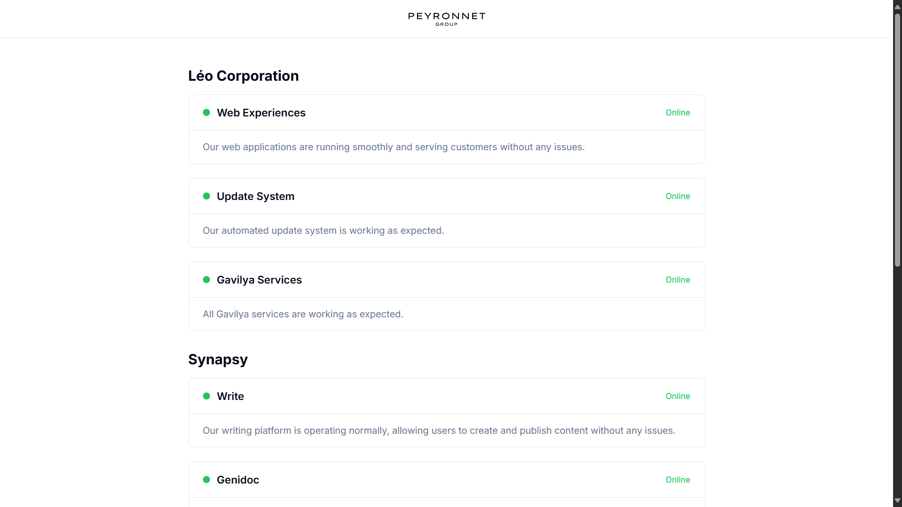
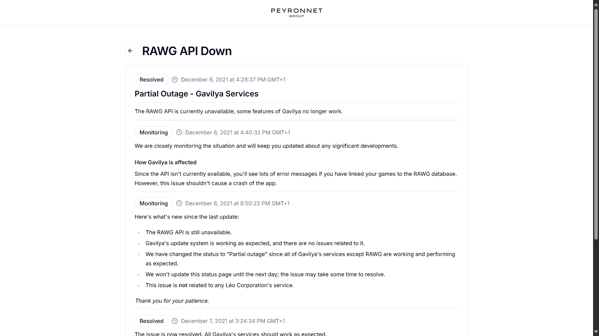

# Peyronnet Group Status Page

This repository contains the source code for the Peyronnet Group Status Page, a Next.js React TypeScript application built using [shadcn/ui](https://github.com/shadcn-ui/ui). The status page provides real-time and historical information on the operational status of various services provided by the Peyronnet Group.

## Project Structure

The project's directory structure is as follows:

```
└── 📁app
    └── 📁incidents
        └── 📁[slug]
            └── page.tsx          // Dynamic page for each incident
        └── incident.mdx          // Incidents are stored in MDX files
        └── page.tsx              // Page displaying a list of incidents
    └── favicon.ico
    └── globals.css
    └── layout.tsx                 // Main layout file
    └── page.tsx                   // Home page of the status site
```

### Key Files and Folders

- **`app/incidents/`**: Contains all the incident reports as `.mdx` files. Each incident is documented with a specific date and description.
- **`app/incidents/[slug]/page.tsx`**: Dynamic route for displaying individual incident details.
- **`app/incidents/page.tsx`**: Lists all incidents, providing an overview of the operational history.
- **`app/layout.tsx`**: The layout component for the application.
- **`app/page.tsx`**: The main entry point for the status page.

## Features

- **Real-Time Updates**: Displays the current operational status of different services/systems.
- **Incident History**: Comprehensive logs of past incidents, including descriptions, dates, and resolutions.
- **Responsive Design**: Fully responsive, with a clean and modern UI.
- **Markdown Support**: Incidents are documented in `.mdx` format, allowing for easy editing and formatting.

## Installation

To get started with the Peyronnet Group Status Page, follow these steps:

1. **Clone the repository**:

   ```bash
   git clone https://github.com/peyronnet-group/status.git
   cd status
   ```

2. **Install dependencies**:

   ```bash
   npm install
   ```

3. **Start the development server**:

   ```bash
   npm run dev
   ```

   The application should now be running at [http://localhost:3000](http://localhost:3000).

## Usage

### Viewing Incidents

To view the list of all incidents, navigate to the homepage. You can click on any incident to view detailed information.

### Adding a New Incident

To document a new incident:

1. Use the CLI tool to create a new incident file.

   ```bash
   node ./cli/create_incident.js
   ```

2. Follow the prompts to enter the incident details, such as date, title, and description.

3. The new incident will be automatically created in the `app/incidents/` directory and listed on the incidents page.

### Editing an Existing Incident

To edit an existing incident:

1. Use the CLI tool to edit the incident file.

   ```bash
   node ./cli/edit_incident.js
   ```

2. Select the incident you wish to edit from the list and follow the prompts.

3. The message you added will automatically be appended to the description of the incident.

## CLI Tools

The `cli` directory contains scripts to help automate the process of creating and editing incidents.

- **`create_incident.js` & `create_incident.ts`**: These scripts allow you to create a new incident by prompting you for the necessary details (date, title, description) and then generating an `.mdx` file in the `app/incidents/` directory.

- **`edit_incident.js` & `edit_incident.ts`**: These scripts enable you to edit an existing incident. They list all incidents and allow you to select one for editing.

### Usage Example

To create a new incident, simply run:

```bash
node ./cli/create_incident.js
```

This will guide you through the process of adding a new incident.

## Screenshots

### Home Page



### Incident Details



## Contributing

We welcome contributions! Please follow these steps to contribute:

1. Fork the repository.
2. Create a new branch (`git checkout -b feature-branch`).
3. Make your changes.
4. Commit your changes (`git commit -m 'Add some feature'`).
5. Push to the branch (`git push origin feature-branch`).
6. Open a pull request.

## License

This project is licensed under the MIT License. See the [LICENSE](LICENSE) file for details.
